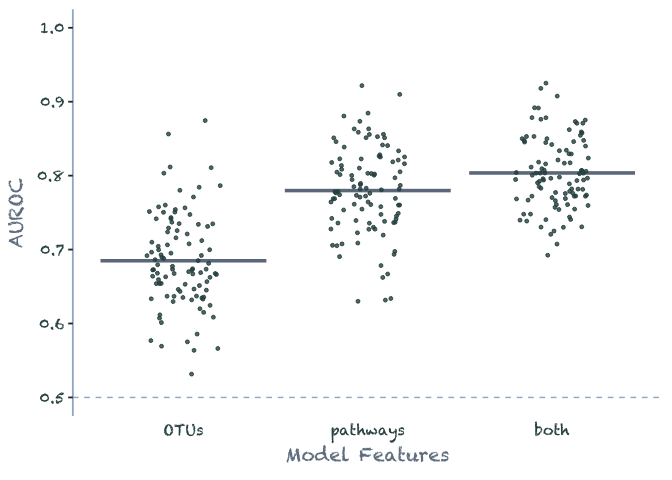

<!-- README.md is generated from README.Rmd. Please edit that file -->

# prelim

<!-- badges: start -->

<!-- badges: end -->

|              |                                                                                                                 |                                |
| ------------ | --------------------------------------------------------------------------------------------------------------- | ------------------------------ |
| Abstract     | [PDF](docs/abstract.pdf)                                                                                        | [TeX](submission/abstract.tex) |
| Proposal     | [PDF](docs/proposal.pdf)                                                                                        | [TeX](submission/proposal.tex) |
| Presentation | [gslides](https://docs.google.com/presentation/d/19kXLBr-lk_3Wva_raEzOGOYW2AH-GfA2ngcSSdOFJlY/edit?usp=sharing) | \-                             |

## Dataset

``` r
library(tidyverse)
```

``` r
metadata <- readxl::read_excel(here::here('data', 'GLNE07samples_baxter.xlsx'))
nrow(metadata)
#> [1] 757
metadata %>% 
    group_by(Diagnosis) %>% 
    summarize(n = n())
#> # A tibble: 6 x 2
#>   Diagnosis            n
#>   <chr>            <int>
#> 1 Adenoma            311
#> 2 Cancer             211
#> 3 High Risk Normal    64
#> 4 Normal             159
#> 5 Pending              7
#> 6 <NA>                 5

metadata %>%
    filter(Diagnosis != 'Pending', !is.na(Diagnosis)) %>% 
    mutate(Diagnosis = recode(Diagnosis,  
                              `High Risk Normal` = 'Normal')
           ) %>% 
    group_by(Diagnosis) %>% 
    summarize(n = n())
#> # A tibble: 3 x 2
#>   Diagnosis     n
#>   <chr>     <int>
#> 1 Adenoma     311
#> 2 Cancer      211
#> 3 Normal      223
```

## Expected Outcomes

``` r
set.seed(2019)
ml1 <- data.frame(OTUs = rnorm(100, .69, .07),
                  pathways = rnorm(100, .79, .06),
                  both = rnorm(100, .81, .05)) %>% 
    pivot_longer(everything(), names_to = "model", values_to = 'auroc') %>% 
    filter(auroc < 1) %>% 
    mutate(model = as_factor(model))
```

``` r
plot_auroc <- function(mldata) {
  mldata %>% ggplot(aes(model, auroc)) +
    stat_summary(fun = mean, geom = "crossbar", color = "slategray4") +
    geom_jitter(color = "darkslategray", alpha = 0.8, size = 1, width = 0.2) +
    geom_hline(yintercept = 0.5, 
               linetype = 'dashed',
               color = 'slategray3') +
    ylim(0.5, 1) +
    labs(y = 'AUROC', x = 'Model Features') +
    theme_classic(base_family = 'Chalkduster', 
                  base_size = 14) + 
    theme(axis.ticks.x = element_line(colour=NA),
          axis.line.x = element_blank(),
          axis.line.y = element_line(color = "slategray3"),
          text = element_text(color = 'slategray'),
          axis.text = element_text(color = 'darkslategray'))
}

ml1 %>% plot_auroc()
```

<!-- -->

``` r
ml2 <- data.frame(potential_pathways = rnorm(100, .76, .06),
                  active_pathways = rnorm(100, .81, .05)) %>% 
  pivot_longer(everything(), names_to = "model", values_to = 'auroc') %>%
  filter(auroc < 1) %>%
  mutate(model = as_factor(model))
ml2 %>% plot_auroc()
```

<!-- -->
